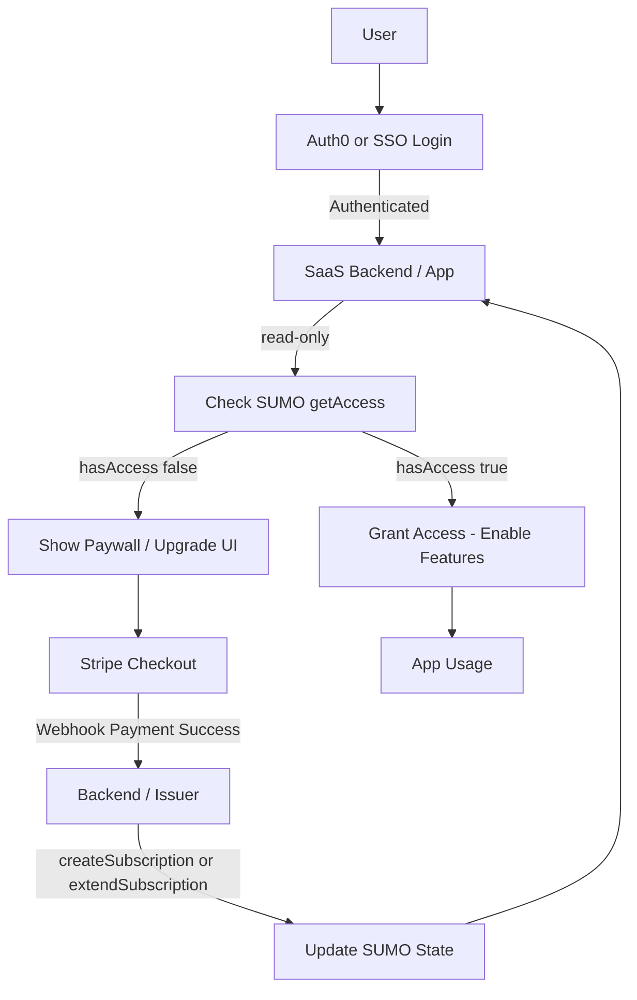

```mermaid
flowchart TD
    U[User] --> A[Auth0 or SSO Login]

    A -->|Authenticated| B[SaaS Backend / App]

    B -->|read-only| C[Check SUMO getAccess]

    C -->|hasAccess true| D[Grant Access - Enable Features]
    C -->|hasAccess false| E[Show Paywall / Upgrade UI]

    E --> F[Stripe Checkout]
    F -->|Webhook Payment Success| G[Backend / Issuer]

    G -->|createSubscription or extendSubscription| H[Update SUMO State]

    H --> B
    D --> I[App Usage]


```
